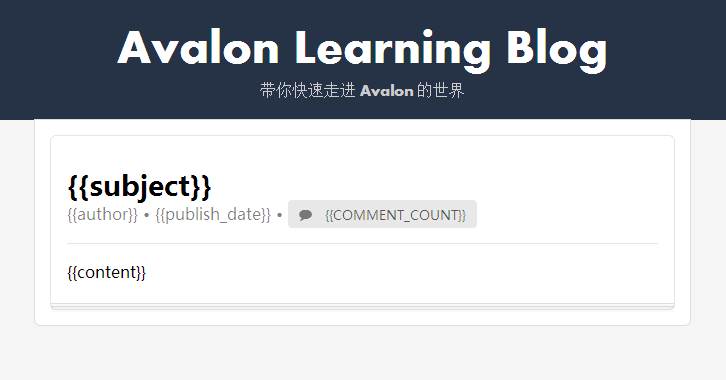
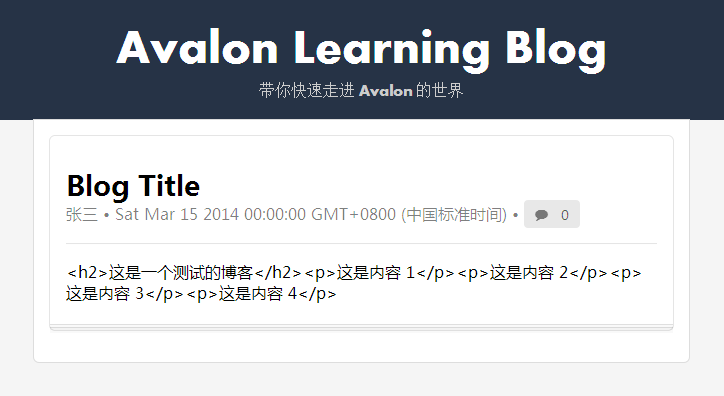

# Blog 基本内容展示

## MVVM 的一些思考

作为初学者，我们没必要对于MVVM的概念刨根问底，不过我们需要知道它的大概工作方式
或原理。在接触 Avalon 之前可能很多人已经用过象 jquery 这样的ajax库，所以可能更习
惯所有的事情都由你来控制，比如：在向后台请求数据之后，调用 jquery 的插件或手工
通过 javascript 来处理数据，在DOM上添加或修改相应的元素，以实现数据的展示。

但是使用了 Avalon 这样的 MVVM 库之后，事情改变了，展示和数据加工可以很好的分离，
Model 负责数据的加工，DOM模板（即 `ms-controller`, `ms-` 这样的属性）负责展示，
而数据和模板之间的动态更新，以至于同步，完全由 Avalon 这样的库来自动处理了（当然
特殊情况下要手工触发）。

并且展示与 DOM 完美的结合，通过设置不同的 `ms-` 属性来实现如：数据显示、事件响应、
属性变化、CSS的修改、引入其它的模板、调用UI组件、动画等功能，基本上几乎所有与UI
相关的处理都可以使用 avalon 来支持。

不过，因为具体的渲染过程不再受你的控制，所以也带来一定的理解或处理上的困难，比如：

* 什么时候，相关数据的渲染完成？因为你可能需要在 DOM 都处理好之后再做一些加工
* 如何做一些初始化的工作？
* 其它与时序相关的处理

不过凡事有弊有利（当然上面的问题也不是没有解决办法，也许不太完美，但是可以不断改
进），这种机制带来的好处我认为有：

* 不同的处理关注的重点更清晰，更易于维护
* 可以极大的减少代码量
* 方便提升页面的动态和交互能力，有利于用户体验的实现

前面讲了一些有关 MVVM 的一些基本的原理（当然还不具体），不易理解的地方以及我认为
它的一些优势。

下面让我们来看一个具体的问题。

## 问题设计

比如我有一篇博客要展示它的基本内容，基本内容可能包括：

* 标题 - subject
* 内容 - content
* 作者 - author
* 日期 - publish_date
* 评论数 - comment_count

那么使用 Avalon 如何在页面上展示它呢？

## 页面设计

先让我们抛开 Avalon ，把博客展示页面先设计出来，因为只是展示，所以不会太复杂。

先让我们看一下设计好的页面效果：



这里 `{{}}` 的内容将是我们要进行替換的地方。整个布局是使用了 [semantic-ui](http://semantic-ui.com/)
这个 CSS 框架，样子还是比较好看的。具体的CSS样式不再说明了，只看一下整个页面的代码。




这个页面没有特别需要讲解的，因为没有一点用到 Avalon 的东西。现在就让我一点点添加
相应的内容。

## 使用 Avalon 来处理页面

### 引入 avalon.js

在 `<head>` 的最下面添加

```
<script src="avalon.js"></script>
```

### 定义 controller

在 `<div id="blogs">` 上添加 `ms-controller="blog"` ，这样我们就定义了一个控制
器，名字为 `blog` 。

### 编写 Model


<script>...^</script>


其实很简单，只是在 `vm` 上定义了一些属性，与DOM中的插值表达式的变量对应。

### 查看效果



不过，你可能看到，日期和内容显示的地方都不是我们想要的，日期显示我希望是 `yyyy-mm-dd` 。
而内容中，因为有 HTML 的标签也被转义了，我希望不被转义。

如何处理，我们将在下一章节学习。

### 调整 vm 结构

上面的代码我们使用了简单的方式，直接在 `vm` 上绑定属性。现在我们改为 object 的
定义形式（类似于 Hash 对象）。


<script>...^</script>


然后修改 DOM 中的插值表达式相应的变量前添加 `blog.` 。

可以看到， Avalon 中可以使用复杂的对象结构。

## 观看演示代码

* [演示代码1 demos/blog_basic.html](../demos/blog_basic.html)
* [演示代码2 demos/blog_basic_1.html](../demos/blog_basic_1.html)
* [演示代码3 demos/blog_basic_2.html](../demos/blog_basic_2.html)
