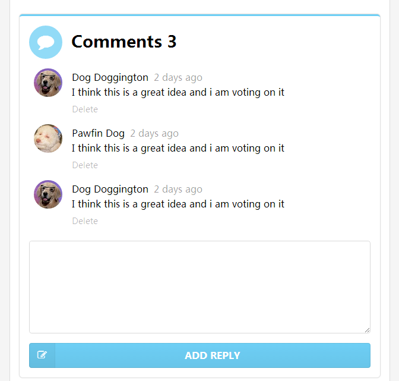

# 评论处理

## 需求定义

在 sementic-ui 中有好看的评论样式，于是我们从中借鉴，进行简单的改造。

先看一下最终的实现效果

上面有评论的总条数，每条评论有：头像，作者，发表时间和内容。然后下面还有一个删
除的文本。最下面是发表回复的文本框，以及提交的按钮。

评论的数据，也将从 json 文件中获取。

## json 数据准备




可以看到一条评论是由：

* `id` 当前评论的数据库 ID, 可以用来进行删除
* `author` 作者
* `date` 发表日期
* `content` 评论内容
* `avatar` 头像地址

这些元素组成。

## 页面展示代码

直接拿到 sementic-ui 的代码还不太符合我的要求，于是对它进行了必要的减化，最终
代码如下：


<!-- comments -->...<!-- end comments -->


这里只有几点要提示：

1. 单独定义了一个 `ms-controller="comments"` ，在一个HTML页面中可以有多个 controller
1. 使用 `ms-repeat=comments` 来进行数据循环，详细说明在下面
1. 使用 `{{comments.size()}}` ，这里不使用 `comments.length` 是因为当数组长度
   变化时，只有 `size()` 会引起页面重新进行渲染。
1. `el` 是 `ms-repeat` 自动生成的循环变量
1. `ms-src` 因为头像的图片地址是要使用变量，所以要将 `src` 属性改为 `ms-src`


所以在属性中用到 Model 中的变量或使用插值表达式的，都要替換成相应的 `ms-` 开头
的属性。不要担心， Avalon 提供了足够多的 `ms-` 属性值供你使用。


## ms-repeat 介绍

这里只对 `ms-repeat` 作简单介绍，详细内容请参见下面的参考文档。

`ms-repeat` 类似于对一个数组进行循环，它放在将要重复生成的元素上，本例中就是
每条评论。这样，当前元素会根据数组的个数重复生成，包括其中的子元素。在循环时会
自动生成一些临时变量，用于DOM模板的处理，如：

* `el` 这个表示循环变量，即当前正在处理的变量
* `$first` 如果是第一个元素，则为 `true`
* `$last` 如果是最后一个元素，则为 `true`
* `$index` 当前元素的索引值

还有其它的一些临时变量，这里不详细描述。我们常用的就是 `el` 这个对象。

因此在下面，我们看到： `el.avatar`, `{{el.author}}`, `{{el.date}}`, `{{el.content|html}}`
就不难理解了。它们都是通过当前元素来引用相应的具体的属性。

## ms-src 介绍

前面已经说过，因为使用了 `el.avatar` 这个变量，所以属性要使用 `ms-src` 。

## JS 代码

下面是完整的 js 代码，包括 Blog 的基本信息展示：





看到了吗？就这么简单。比原来的内容，増加了：

1. comments Model 的定义，但也只是有一个空数组
2. 増加了使用 `$.getJSON()` 获得评论数据的处理。这块就是一个简单的赋值，也没什么
   多说的。

对于评论总条数，我们没有特殊处理，只是使用了 `{{comments.size()}}` ，这样只要
评论条数变化，界面自动变化。真是省了大量的工作。

## ms-repeat 和 ms-each 的区别

在 Avalon 中，是先有 `ms-each` 后来才出现的 `ms-repeat` 。它们两个使用不太一样：

* `ms-repeat` 是定义在要循环的元素上，因此，不会影响其它同级和父元素。
* `ms-each` 是定义在父元素上，但是复制的是它下面的所有子元素。因此，如果你需要
  在循环时，有些子元素不参与复制就没办法了。

所以目前， `ms-repeat` 是更方便的用法。

## 问题

1. `ms-repeat` 能不能定义 `el` 之外的循环变量？

    答案：可以。使用 `ms-repeat-name` 。
2. `ms-repeat` 能不能支持多层嵌套？

    答案：可以。示例参见: http://runjs.cn/code/8dss3sov

## 观看演示代码

* [演示代码1 demos/comments.html](../demos/comments.html)

## 参考文档

* [ms-repeat][1]

[1]: http://www.cnblogs.com/rubylouvre/p/3181291.html#top19
