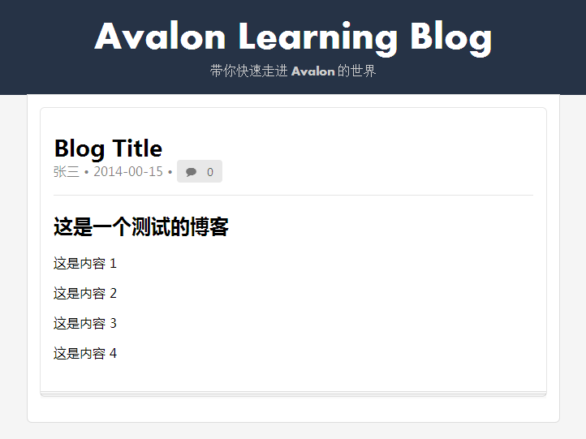

# 使用 filter

## 介绍

在上一章我们看到日期和内容不是我们预期的，所以我们需要对它们进行处理。在 Avalon
中可以很方便地使用 filter 来进行处理。

filter 可以用在插值表达式之后（还记得插值表达式吗？就是 `{{}}` 这样的内容），对
前面输出的结果进行再加工的函数。

它的写法是：

```
{{ expression | filter }}
```

在 Avalon 中已经预定义了许多实用的 filter ，可以查看 [filter][1] 
的文档了解更多。

## date 和 html

这里面对我们有用的是两个: `date` 和 `html`

其中 `date` 可以将一个日期字段转換为各种格式，所以我们可以将 `{{publish_date}}`
改为 `{{publish_date|date('yyyy-MM-dd')}}` 。


这里月是使用 `MM` ，而 `mm` 表示分钟。对于日期的取值 Avalon 很灵活，可以支持很多
种情况，如： Date 对象， '2014/03/15' 等多种字符串格式。详细参见关于 [filter][1]
文档中关于 date 的描述。


`html` 则可以将文本不进行转义处理。缺省情况下，插件表达式的结果会自动进行转义。
所以我们将 `{{content}}` 改为 `{{content|html}}` 。修改后再查看页面，结果为：

## 显示结果



## 自定义 filter

如果 Avalon 提供的 filter 不能满足我们的要求，我们也可以自定义 filter。

一个基本的 filter 定义格式为：

```
avalon.filters.myfilter = function(str, arg1, arg2, ...){
    return result;
}
```

从上面的定义可以看出，第一个参数 `str` 就是前面返回的结果。除了第一个参数必须要
定义外，你还可以定义额外的参数，如前面的 `date` 就需要一个格式串。根据 filter
有没有参数，在使用它时，可以类似于函数调用，如 `{{publish_date|date('yyyy-mm-dd')}}` 也可以只是
个名字，如 `{{content|html}}` 。

## filter 连用

在复杂情况下，filter还可以连用，如：

```
{{ prop | filter1 | filter2 | filter3(args, args2) | filter4(args)}}
```

## 观看演示代码

* [演示代码1 demos/filter.html](../demos/filter.html)

## 参考文档

* [filter文档][1]

[1]: http://www.cnblogs.com/rubylouvre/p/3181291.html#top24